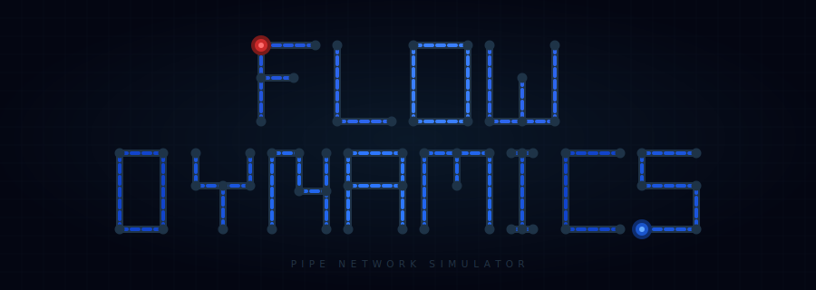

<div align="center">



<br><br>

<a href="https://www.buymeacoffee.com/sormond">
  
</a>

<br><br>

# Flow Dynamics

**A terminal pipe network designer and fluid flow simulator — built with Rust and ratatui.**

<br>


</div>

---

> Draw plumbing layouts on a terminal canvas, run live pressure and flow simulations,
> annotate your designs, and export everything to text or JSON.

---

## Features

- **Live simulation** — pressure and GPM propagate through your network in real time
- **Full pipe set** — straight runs, elbows, tees, crosses, reducers, ball valves, check valves, endcaps, gauges
- **Fixture components** — Toilet, Faucet/Sink, Basin Sink (with overflow animation), Water Heater, Water Softener, Whole House Filter (⊞), Sediment Filter (⊟), UV Filter (⊕), Pressure Gauge (⊙)
- **Annotations** — inline Labels and multi-line framed Notes placed directly on the canvas
- **Assembly system** — save any region as a named assembly and stamp it anywhere
- **Glyph editor** — remap any component's character and color; design fully custom multi-cell composites with inlet/outlet/drain ports
- **Undo / Redo** — every edit is undoable, up to 50 steps (Ctrl+Z / Ctrl+Y)
- **Export** — dump the canvas as a UTF-8 text file or JSON layout
- **Materials** — Copper, PEX, GalvanizedIron, PE, BlackPlastic, CastIron — each color-coded
- **Settings** — persistent config with auto-loadable glyph library files
- **Custom splash screen** — save any layout as `splash.json` for a live animated boot screen

---

## Quick Start

```bash
git clone https://github.com/sormond/flow-dynamics.git
cd flow-dynamics
cargo build --release
./target/release/flow-dynamics        # Linux / macOS
target\release\flow-dynamics.exe      # Windows
```

Requires Rust 1.75+ and a terminal that supports Unicode and 256 colors
(Windows Terminal, iTerm2, Alacritty, Kitty, or any modern terminal emulator).

---

## How It Works

```
  [Tab]  ──  switch focus between canvas and palette
  [P]    ──  start simulation
  [S]    ──  stop simulation
  [H]    ──  open in-app help (scrollable, hot-reloads help.txt)
```

1. **Focus the palette** (`Tab`) and navigate to the component you want.
2. **Focus the canvas** (`Tab`) and move the cursor with arrow keys.
3. Press **`Enter`** to place the component.
4. Connect pipes from a **Source** to a **Sink**, then press **`P`** to simulate.

---

## Key Bindings — Quick Reference

### Global

| Key | Action |
|-----|--------|
| `H` | Open / close help |
| `Q` | Quit |
| `Tab` | Switch focus (Canvas ↔ Palette) |
| `N` | New diagram |
| `Ctrl+S` | Save layout |
| `Ctrl+O` | Open layout |
| `Ctrl+Z` | Undo |
| `Ctrl+Y` | Redo |
| `P` | Run simulation |
| `S` | Stop simulation |
| `Space` | Pause / resume |
| `X` | Export (Text or JSON) |
| `B` | Bill of Materials |
| `Y` | Assembly browser |
| `R` | Rectangle selection |
| `G` | Glyph editor |
| `C` | Settings |
| `A` | Toggle dimension annotations |
| `F` | Cycle fluid type |
| `1`–`6` | Select material |

### Canvas (Build mode)

| Key | Action |
|-----|--------|
| `Arrow keys` | Move cursor |
| `Home` / `End` | Jump to first / last component |
| `Enter` | Place component |
| `Del` | Delete component at cursor |
| `V` | Toggle valve open/closed |
| `M` | Cycle material |
| `D` | Cycle diameter |
| `T` | Cycle drain/sink type |
| `+` / `-` | Adjust pipe length (Shift = ±6 in) |
| `I` / `Shift+I` | Increase / decrease source pressure |
| `L` | Enter exact pipe length |
| `E` | Edit label or note at cursor |

### All Lists (Palette, File Browser, Assembly Browser, etc.)

| Key | Action |
|-----|--------|
| `↑` / `↓` | Move one item |
| `PageUp` / `PageDown` | Jump 10 items |
| `Home` / `End` | Jump to first / last item |

---

## Annotations

Place a **Label** or **Note** from the palette, then press `Enter` to type your text.

- **Labels** — single-line text that spreads across empty canvas cells in bright yellow
- **Notes** — multi-line text in a double-line framed box. In the note editor, arrow keys
  move the cursor, `Shift+Enter` inserts a line break, and `Enter` confirms. You may also
  type `|` as a line separator. An `[E]dit` hint appears when your cursor is on the box.

Both annotation types are excluded from the simulation and BOM.

---

## Palette Colors

When a component that supports color overrides is selected (custom glyph components), a
**Palette Colors** panel appears at the bottom of the palette. Cycle focus to it with `Tab`.

| Key | Action |
|-----|--------|
| `Arrow` | Navigate the color swatch grid |
| `Home` / `End` | Jump to first / last material |
| `E` | Enter a custom RGB color (R,G,B prompt) |
| `M` | Cycle the material scope for this color override |

---

## Export

Press `X` from any build or simulation screen.

| Option | Output |
|--------|--------|
| `T` — Text | UTF-8 canvas dump (labels and note frames included) |
| `J` — JSON | Full layout data (same format as a saved layout) |

The text export is ideal for pasting pipe diagrams into documentation or sharing as ASCII art.

---

## Glyph Editor

Press `G` to open. Customize any component's display character and color, or design
entirely new multi-cell composites with directional ports:

| Key | Action |
|-----|--------|
| `Tab` | Cycle panel focus: Component list → Symbol grid → Color picker |
| `Arrow` | Navigate within the focused panel |
| `Home` / `End` | Jump to first / last component |
| `Enter` | Apply selected character + color as glyph override |
| `M` | Cycle material scope |
| `D` | Cycle diameter scope (or set Drain port on a border cell) |
| `W` | Set composite width |
| `I` | Set border cell as **Inlet** |
| `O` | Set border cell as **Outlet** |
| `E` | Enter custom RGB color (R,G,B prompt) |
| `N` | New custom component |
| `Del` | Clear tile under the composite editor cursor |
| `S` / `L` | Save / Load glyph library |
| `Q` / `G` | Exit the glyph editor |

Custom components participate fully in simulation — their ports define how fluid flows through them.

---

## File Layout

```
flow-dynamics/
├── src/               Rust source
├── glyphs.json        Default glyph overrides (optional)
├── splash.json        Animated splash screen layout (optional)
├── help.txt           In-app help content (hot-reloadable)
└── flow-dynamics.config.json   Persistent settings (auto-created)
```

---

## License

MIT — see [LICENSE](LICENSE) for details.

---

<div align="center">

If Flow Dynamics saves you time or sparks joy, a coffee keeps the valves flowing!

<a href="https://www.buymeacoffee.com/sormond">
  
</a>

</div>
